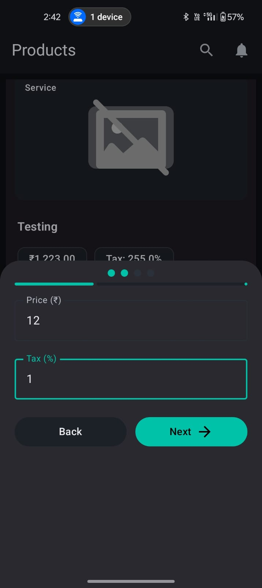

# Swipe Products – Android Assignment

This repository contains the implementation of the **Swipe Products App**, developed as part of the Swipe Android Assignment.  
The project demonstrates modern Android development practices using **Jetpack Compose**, **MVVM architecture**, **Retrofit**, **Room**, **WorkManager**, and **Dagger Hilt** for dependency injection.

## Table of Contents
1. [Overview](#overview)  
2. [Features](#features)  
3. [Technologies Used](#technologies-used)  
4. [Project Structure](#project-structure)  
5. [Setup and Installation](#setup-and-installation)  
6. [Screenshots](#screenshots)  

---

## Overview

The **Swipe Products App** allows users to:
- Browse and search for products retrieved from the **Swipe API**.  
- Add new products with details such as **name, type, price, tax**, and optional **images**.  
- Use the app **offline** — any products added without internet are stored locally and automatically synced when connectivity returns.  
- View notifications tracking the status of uploads — even after the app is closed.

This project was built with a focus on **clean architecture**, **modularization**, and **production-ready code quality**.

---

## Features

### 1. Product Listing Screen
- Fetches and displays all products from the API:  
  `GET https://app.getswipe.in/api/public/get`
- Provides a **search bar** to filter by name, type, or price.  
- Loads product images via **Coil** (shows a default placeholder when unavailable).  
- Displays **loading indicators** during data fetch.  
- Allows navigation to the Add Product screen via a **floating action button (FAB)**.  
- Supports **offline caching** to persist previously fetched data.

### 2. Add Product Screen (Bottom Sheet)
- Allows users to add new products using the endpoint:  
  `POST https://app.getswipe.in/api/public/add`
- Includes input validation for:
  - Product type selection (dropdown).  
  - Non-empty product name.  
  - Decimal validation for price and tax.  
- Displays **upload progress indicators** and **Snackbar** or **Dialog** feedback on success/failure.  
- Integrates with **Notification Manager** for background status updates.

### 3. Offline Mode and Sync
- Products added offline are stored locally in **Room Database**.  
- On network reconnection, a **WorkManager job** automatically uploads pending items.  
- All sync events are reflected in the notification screen for transparency.

### 4. Notifications
- A dedicated **Notification Screen** shows the history and real-time status of product uploads.  
- Statuses include: *In Progress*, *Success*, and *Failed*.  
- Notifications are preserved and updated even when the app restarts.

---

## Technologies Used

| Category | Tools / Libraries |
|-----------|------------------|
| **Architecture** | MVVM + Clean Architecture |
| **UI** | Jetpack Compose (Material 3) |
| **Networking** | Retrofit, OkHttp |
| **Dependency Injection** | **Dagger Hilt** |
| **Database** | Room |
| **Background Tasks** | WorkManager |
| **Image Loading** | Coil |
| **Concurrency** | Kotlin Coroutines, Flows |
| **Design System** | Material Theme 3 + Custom color palette |
| **Utility** | NotificationHelper, NetworkUtils |

---

## Project Structure
```
com.example.swipe_assignment/
│
├── data/
│ ├── api/ # Retrofit interfaces & DTOs
│ ├── db/ # Room database, entities, DAOs
│ └── repository/ # Data source implementations
│
├── domain/
│ ├── model/ # Core models (Product, Resource)
│ └── repository/ # Abstract repository interfaces
│
├── presentation/
│ ├── product/ # Product listing & add product screens
│ ├── notification/ # Notification UI
│ ├── navigation/ # NavHost and routes
│ └── theme/ # Colors, typography, theme
│
├── di/ # Dagger modules
├── utils/ # Helpers (network, notifications)
└── worker/ # WorkManager for offline sync
```
## Setup and Installation

### Steps to Run
1. Clone the repository:
   ```bash
   git clone https://github.com/manas-yu/swipe_products.git
2. Open the project in Android Studio (Giraffe or later).

3. Sync Gradle dependencies.

4. Build and run the app on an emulator or device (API 24+).

## Screenshots

|  |  |  |
|:------------------------------------------:|:------------------------------------------:|:------------------------------------------:|

|  |  |  |
|:------------------------------------------:|:------------------------------------------:|:------------------------------------------:|

|  |  |  <video src="https://github.com/user-attachments/assets/947a88a7-91b2-4926-b7ee-163b1d7745bd" width="200" controls></video> |
|:------------------------------------------:|:------------------------------------------:|:------------------------------------------:|


